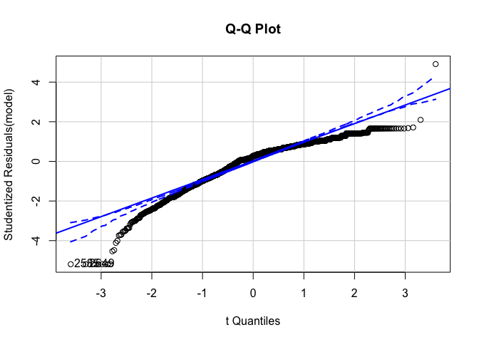
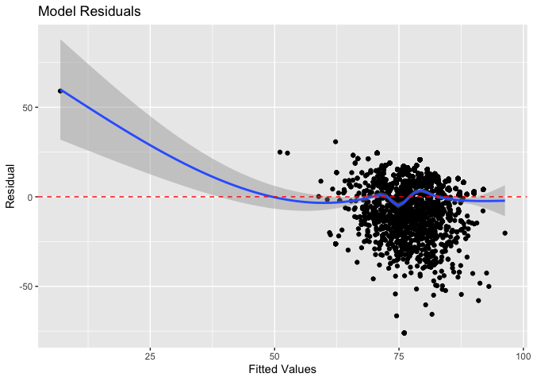
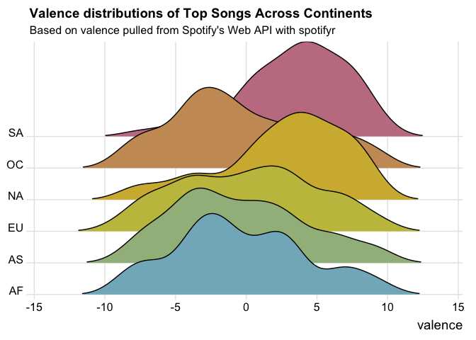
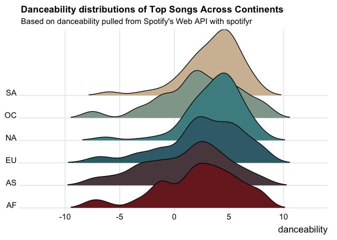
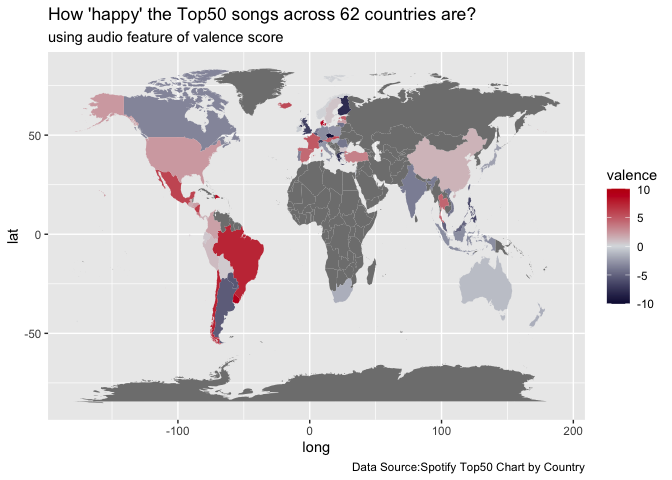
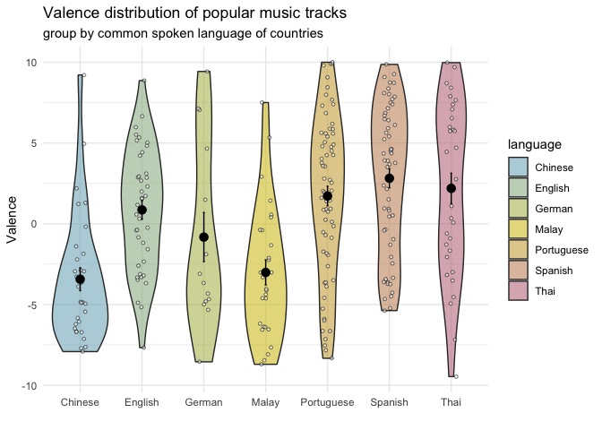
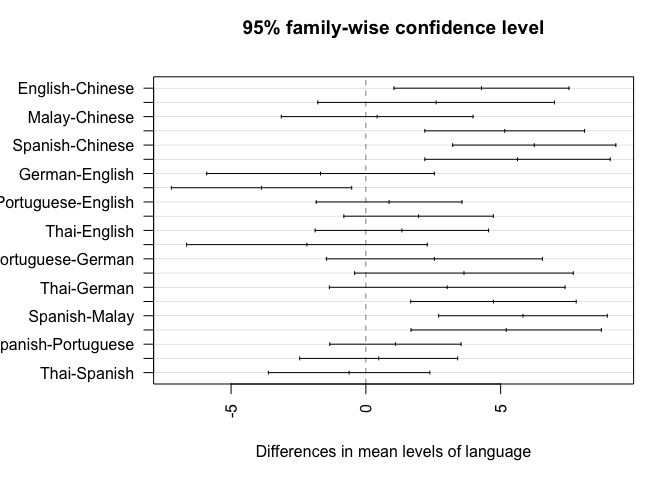

Spotify Top50 tracks by Country Analysis
================
JiaYan
10/6/2019

## Introduction

Spotify provides an access of audio features’ metadata of all songs
available in its platform. We can collect this metadata at our disposal
through the API key. The following analysis is an attempt to find
relationship among the audio features and to find if there is a music
preference geographically or linguistically.

## Setup

In order to access Spotify data, first register yourself a “Spotify for
Developer” account and get your API key by selecting the Dashboard then
click on “Create a Client ID” and fill in the required questions. Go to
your new app page, click on “Show Client Secret” to retrieve your Client
Secret, copy it and your Client ID to replace the following. The you
will have your Spotify access token. *Note: make sure
“<http://localhost:8888>” and “<http://localhost:8888/callback>” are
added under Redirect URIs from the settings*

Using the lightweight R wrapper I developed to retreive all Top 50
tracks by country via Spotify’s Web API, I output the data saved as
`.txt` using `dput` function. The data can be easily loaded back to R by
running the `dput` function.

``` r
topTrack <- dget(file = "/Users/jiayan/Documents/GitHub/spotifyrLite/Spotify_Top50_byCountry.txt")
```

## Data Cleansing

A little house-keeping for the dataframe. Since the data was accessed in
Germany, I have to map the respective countries name to its respective
English name (as later on I will need to join by country name with
map\_data to get its coordinates). An additional column of “Continent”
is added so that we can make analysis on higher level.

``` r
library(plyr)
library(dplyr) # To use piping
```

    ## Warning: package 'dplyr' was built under R version 3.6.2

    ## Warning: replacing previous import 'vctrs::data_frame' by 'tibble::data_frame'
    ## when loading 'dplyr'

``` r
topTrack$Country <- as.character(mapvalues(topTrack$Country,from = c('Australien', 'Österreich', 
'Belgien', 'Bolivien', 'Kanada', 'Bulgarien', 'Brasilien', 'Dänemark', 'Tschechische', 'Estland', 'Deutschland', 'Frankreich', 'Finnland', 'Griechenland', 'Ungarn', 'Island', 'Irland', 'Israel', 
'Italien', 'Luxemburg','Litauen', 'Lettland', 'Mexiko', 'Neuseeland', 'Niederlande', 'Norwegen', 
'Polen', 'Rumänien', 'Portugal', 'Slowakei', 'Südafrika', 'Spanien', 'Schweden', 'Schweiz', 
'Großbritannien', 'USA', 'Uruguay', 'Peru', 'Panama', 'Paraguay','Nicaragua', 'Guatemala', 
'Honduras', 'Ecuador', 'El', 'Argentinien', 'Costa', 'Chile', 'Kolumbien', 'Dominikanische', 
'Türkei', 'Hong Kong', 'Indonesien', 'Malaysia', 'Malta', 'Philippinen', 'Singapur', 'Taiwan', 
'Thailand', 'Japan','Indien','Vietnam'),
to=c('Australia', 'Austria', 'Belgium', 'Bolivia', 'Canada', 'Bulgaria', 'Brazil', 'Denmark', 
     'Czech Republic', 'Estonia', 'Germany', 'France', 'Finland', 'Greece', 'Hungary', 'Iceland', 
     'Ireland', 'Israel', 'Italy', 'Luxembourg','Lithuania', 'Latvia', 'Mexico', 'New Zealand', 
     'Netherlands', 'Norway', 'Poland', 'Romania', 'Portugal', 'Slovakia', 'South Africa', 'Spain', 
     'Sweden', 'Switzerland', 'UK', 'USA', 'Uruguay', 'Peru', 'Panama', 'Paraguay', 'Nicaragua', 
     'Guatemala', 'Honduras', 'Ecuador', 'El Salvador', 'Argentina', 'Costa Rica', 'Chile', 
     'Colombia', 'Dominican  Republic', 'Turkey','China','Indonesia','Malaysia', 'Malta' ,
     'Philippines', 'Singapore', 'Taiwan', 'Thailand', 'Japan','India', 'Vietnam')))

topTrack$Continent <- ""
topTrack %<>% 
  mutate(Continent=replace(Continent, Country %in% c('Turkey','China','Indonesia', 'Malaysia', 'Philippines', 'Singapore', 'Taiwan', 'Thailand', 'Japan','India', 'Vietnam','Israel'), "AS")) %>%  mutate(Continent=replace(Continent, Country %in% c('Austria', 'Belgium', 'Bolivia', 'Bulgaria', 'Denmark', 'Czech Republic', 'Estonia', 'Germany', 'France', 'Finland', 'Greece', 'Hungary', 'Iceland', 'Ireland', 'Italy', 'Luxembourg','Lithuania', 'Latvia', 'Netherlands', 'Norway', 'Poland', 'Romania', 'Portugal', 'Slovakia', 'Spain', 'Sweden', 'Switzerland','Malta','UK'), "EU")) %>%  
  mutate(Continent=replace(Continent, Country %in% c('Canada', 'USA', 'Mexico', 'Panama', 'Nicaragua', 'Guatemala', 'Honduras', 'El Salvador', 'Costa Rica', 'Dominican Republic'), "NA")) %>% mutate(Continent=replace(Continent, Country %in% c('Brazil', 'Uruguay', 'Peru', 'Paraguay', 'Ecuador', 'Argentina', 'Chile', 'Colombia'), "SA")) %>% 
  mutate(Continent=replace(Continent, Country %in% c('Australia', 'New Zealand'), "OC")) %>%
  mutate(Continent=replace(Continent, Country %in% c('South Africa'), "AF"))
```

## Exploratory Data Analysis

Because of simplicity, we like make an assumption about the existence of
linearity in the data but we have to check the validty of such
assumption. So we plot a Q-Q plot to verify that. We can also check if
there is a pattern exists in the residuals of the model. A linear model
fit should have non-correlated residuals and its qqPlot should be fitted
to a line. We can see that both plots violated the condiitions so we
have to look beyond a linear model.

``` r
library(car)
```

    ## Warning: package 'car' was built under R version 3.6.2

    ## Warning: package 'carData' was built under R version 3.6.2

``` r
library(ggplot2)
```

    ## Warning: package 'ggplot2' was built under R version 3.6.2

``` r
feature <- topTrack %>% select(Popularity, danceability, energy, key, loudness, mode, speechiness, 
                               acousticness, instrumentalness, liveness, valence, tempo, duration_ms)
model <- lm(formula = Popularity ~ ., feature)
qqPlot(model, labels=row.names(topChart), id.method="identify", simulate=TRUE, 
       main="Q-Q Plot")
```

<!-- -->

    ## [1] 2585 2649

``` r
model %>% broom::augment() %>% ggplot(aes(x=.fitted,y=.resid)) +
  geom_point() + geom_smooth() + geom_hline(yintercept = 0,color="red",linetype = 2) +
  labs(title = "Model Residuals",x = "Fitted Values", y = "Residual")
```

<!-- -->

The preliminaries analysis above show that feature reduction is the next
sensible move. Before that I am going to handpick an interesting audio
feature which is the valence score. Simply put, this score indicates the
happiness level of the song (given on the scale of 0-1; for 1 being
happy; 0 being sad). It is interesting to see how latin America
countries & Spanish speaking countries dominated the rank of mean
valence score.

``` r
library(ggplot2)
library(gameofthrones)
library(scales) #rescale values 
library(wrapr) # for piping with ggplot
library(ggjoy) # to plot joyplot

# Allow piping into ggplot2
apply_left.gg <- function(pipe_left_arg, pipe_right_arg, pipe_environment, left_arg_name,
                          pipe_string, right_arg_name) { pipe_right_arg <- eval(pipe_right_arg,
                         envir = pipe_environment, enclos = pipe_environment)
  pipe_left_arg + pipe_right_arg 
}

# rescale the valence & dancebility score to make it more interpretable 
topTrack$valence <- rescale(topTrack$valence, to = c(-10, 10))
topTrack$danceability <- rescale(topTrack$danceability, to = c(-10, 10))

valenceRank <- topTrack %>% group_by(Country) %>% dplyr::summarise(mean = mean(valence)) %>% arrange(desc(mean))
head(valenceRank,20)
```

    ## # A tibble: 20 x 2
    ##    Country             mean
    ##    <chr>              <dbl>
    ##  1 Ecuador            4.20 
    ##  2 Bolivia            4.16 
    ##  3 Panama             4.16 
    ##  4 Colombia           3.97 
    ##  5 Guatemala          3.96 
    ##  6 El Salvador        3.82 
    ##  7 Costa Rica         3.81 
    ##  8 Uruguay            3.76 
    ##  9 Peru               3.70 
    ## 10 Spain              3.70 
    ## 11 Paraguay           3.57 
    ## 12 Mexico             3.49 
    ## 13 Brazil             3.22 
    ## 14 Honduras           2.88 
    ## 15 Argentina          2.87 
    ## 16 Nicaragua          2.69 
    ## 17 Dominican Republic 2.59 
    ## 18 Chile              2.20 
    ## 19 Thailand           1.60 
    ## 20 Austria            0.953

``` r
tail(valenceRank,10)
```

    ## # A tibble: 10 x 2
    ##    Country       mean
    ##    <chr>        <dbl>
    ##  1 Italy       -0.817
    ##  2 France      -0.850
    ##  3 Malaysia    -0.901
    ##  4 Vietnam     -0.981
    ##  5 China       -1.12 
    ##  6 Luxembourg  -1.18 
    ##  7 Indonesia   -1.22 
    ##  8 Philippines -1.29 
    ##  9 Greece      -1.69 
    ## 10 Taiwan      -2.13

On continent level, the valence distributions of North America and South
America are skewed more toward the positive value but all continents
have similar wide spread.

``` r
ggplot(topTrack, aes(x=valence, y=Continent, fill=Continent)) %.>% 
  geom_joy(scale=3, rel_min_height=0.01) %.>% 
  scale_fill_got(discrete = TRUE, option = "Margaery") %.>%  
  scale_y_discrete(expand = c(0.01, 0)) %.>% 
  ggtitle("Valence distributions of Top Songs Across Continents", 
          subtitle = "Based on valence pulled from Spotify's Web API with spotifyr") %.>%
  theme_joy() %.>% theme(axis.title.y = element_blank(), legend.position='none')
```

<!-- -->

It is likely that the danceability of a song highly related to how happy
the song is so I made another joyplot for danceability on continent
level.

``` r
ggplot(topTrack, aes(x=danceability, y=Continent, fill=Continent)) +
  geom_joy(scale=3, rel_min_height=0.01) +
  scale_fill_got(discrete = TRUE, option = "Daenerys") +
  scale_y_discrete(expand = c(0.01, 0)) +
  ggtitle("Danceability distributions of Top Songs Across Continents", subtitle = "Based on danceability pulled from Spotify's Web API with spotifyr") +
  theme_joy() +
  theme(axis.title.y = element_blank(),
        legend.position='none')
```

<!-- -->

``` r
left_join(map_data('world'), topTrack, by = c('region' = 'Country')) %.>% 
  ggplot(., aes(x = long, y = lat, group = group)) %.>% geom_polygon(aes(fill = valence)) %.>%
  scale_fill_got(option = "Tully") %.>% 
  labs(title = "How 'happy' the Top50 songs across 62 countries are?", 
       subtitle = "using audio feature of valence score", 
       caption = "Data Source:Spotify Top50 Chart by Country") 
```

<!-- -->

``` r
df_Language <- topTrack %>% mutate(language = "")  %>% 
mutate(language = replace(language, Country %in% c("China", "Taiwan"), "Chinese")) %>%
mutate(language = replace(language, Country %in% c("Malaysia", "Indonesia"), "Malay")) %>% 
mutate(language = replace(language, Country %in% c("Thailand"), "Thai")) %>% 
mutate(language = replace(language, Country %in% c("UK", "USA", "Ireland", "Canada", "Australia",
                                                   "New Zealand"), "English")) %>% 
mutate(language = replace(language, Country %in% c("Austria", "Germany","Switzerland"),"German"))%>%
mutate(language = replace(language, Country %in% c("Argentina", "Bolivia", "Chile", "Colombia", 
                                                   "Costa Rica", "Dominican Republic", "Ecuador", 
                                                   "El Salvador", "Honduras","Mexico", "Nicaragua",
                                                   "Panama", "Paraguay", "Peru", "Spain",
                                                   "Uruguay"),"Spanish")) %>% 
mutate(language = replace(language, Country %in% c("Portugal", "Brazil"), "Portuguese")) %>% 
filter(language != "")

byLanguage <- list(list("China", "Taiwan"), list("Malaysia", "Indonesia"), list("Austria", "Germany","Switzerland"), list("Argentina", "Bolivia", "Chile", "Colombia", "Costa Rica", 
"Dominican Republic", "Ecuador", "El Salvador", "Honduras","Mexico", "Nicaragua","Panama", 
"Paraguay", "Peru", "Spain", "Uruguay"), list("UK", "USA", "Ireland", "Canada", "Australia", 
                                              "New Zealand"), list("Portugal", "Brazil"))
names(byLanguage) <- c("Chinese", "Malay", "German", "Spanish", "English", "Portuguese")
dict_language <- function(x) {byLanguage[[x]]}

combinatorial <- data.frame(rbind(0,0))
for(i in 1:length(names(byLanguage))){
  combinatorial <- cbind(combinatorial,combn(dict_language(names(byLanguage)[i]),2))  
}
combinatorial <- combinatorial[-1]
names(combinatorial) <- 1:dim(combinatorial)[2]

for(i in 1:dim(combinatorial)[2]){
  subset <- df_Language %>% filter(Country %in% unlist(combinatorial[i]))
  idx <- duplicated(subset$Track.Id) | duplicated(subset$Track.Id, fromLast = T)
  result <- t.test(valence ~ Country, data = subset[!idx,])
  if(result$p.value < 0.01){print(result)}
}
```

    ## 
    ##  Welch Two Sample t-test
    ## 
    ## data:  valence by Country
    ## t = -3.1222, df = 23.196, p-value = 0.004757
    ## alternative hypothesis: true difference in means is not equal to 0
    ## 95 percent confidence interval:
    ##  -8.207357 -1.667607
    ## sample estimates:
    ## mean in group Argentina   mean in group Bolivia 
    ##              -0.9200141               4.0174680 
    ## 
    ## 
    ##  Welch Two Sample t-test
    ## 
    ## data:  valence by Country
    ## t = -2.9597, df = 25.954, p-value = 0.006497
    ## alternative hypothesis: true difference in means is not equal to 0
    ## 95 percent confidence interval:
    ##  -8.042040 -1.449475
    ## sample estimates:
    ## mean in group Argentina   mean in group Ecuador 
    ##              -0.7931994               3.9525581 
    ## 
    ## 
    ##  Welch Two Sample t-test
    ## 
    ## data:  valence by Country
    ## t = -4.43, df = 7.9723, p-value = 0.002216
    ## alternative hypothesis: true difference in means is not equal to 0
    ## 95 percent confidence interval:
    ##  -13.475077  -4.245334
    ## sample estimates:
    ## mean in group Argentina   mean in group Uruguay 
    ##               -2.999344                5.860862 
    ## 
    ## 
    ##  Welch Two Sample t-test
    ## 
    ## data:  valence by Country
    ## t = 4.9308, df = 31.361, p-value = 2.548e-05
    ## alternative hypothesis: true difference in means is not equal to 0
    ## 95 percent confidence interval:
    ##  3.374139 8.130616
    ## sample estimates:
    ## mean in group Bolivia   mean in group Chile 
    ##             5.1638848            -0.5884927 
    ## 
    ## 
    ##  Welch Two Sample t-test
    ## 
    ## data:  valence by Country
    ## t = 2.8176, df = 29.556, p-value = 0.008542
    ## alternative hypothesis: true difference in means is not equal to 0
    ## 95 percent confidence interval:
    ##  1.193963 7.498518
    ## sample estimates:
    ##            mean in group Bolivia mean in group Dominican Republic 
    ##                        4.6097377                        0.2634969 
    ## 
    ## 
    ##  Welch Two Sample t-test
    ## 
    ## data:  valence by Country
    ## t = 3.1784, df = 23.368, p-value = 0.004135
    ## alternative hypothesis: true difference in means is not equal to 0
    ## 95 percent confidence interval:
    ##  1.975067 9.320223
    ## sample estimates:
    ##   mean in group Bolivia mean in group Nicaragua 
    ##                4.613197               -1.034448 
    ## 
    ## 
    ##  Welch Two Sample t-test
    ## 
    ## data:  valence by Country
    ## t = -3.5972, df = 40.832, p-value = 0.0008601
    ## alternative hypothesis: true difference in means is not equal to 0
    ## 95 percent confidence interval:
    ##  -6.290227 -1.766494
    ## sample estimates:
    ##    mean in group Chile mean in group Colombia 
    ##             0.07080209             4.09916271 
    ## 
    ## 
    ##  Welch Two Sample t-test
    ## 
    ## data:  valence by Country
    ## t = -3.2331, df = 40.342, p-value = 0.002443
    ## alternative hypothesis: true difference in means is not equal to 0
    ## 95 percent confidence interval:
    ##  -5.936701 -1.370234
    ## sample estimates:
    ##      mean in group Chile mean in group Costa Rica 
    ##                0.2378632                3.8913307 
    ## 
    ## 
    ##  Welch Two Sample t-test
    ## 
    ## data:  valence by Country
    ## t = -4.7721, df = 33.689, p-value = 3.451e-05
    ## alternative hypothesis: true difference in means is not equal to 0
    ## 95 percent confidence interval:
    ##  -7.925719 -3.190253
    ## sample estimates:
    ##   mean in group Chile mean in group Ecuador 
    ##            -0.8169863             4.7410000 
    ## 
    ## 
    ##  Welch Two Sample t-test
    ## 
    ## data:  valence by Country
    ## t = -2.8252, df = 41.025, p-value = 0.007266
    ## alternative hypothesis: true difference in means is not equal to 0
    ## 95 percent confidence interval:
    ##  -6.326448 -1.052084
    ## sample estimates:
    ##       mean in group Chile mean in group El Salvador 
    ##                0.07676856                3.76603488 
    ## 
    ## 
    ##  Welch Two Sample t-test
    ## 
    ## data:  valence by Country
    ## t = -3.5217, df = 44.392, p-value = 0.001006
    ## alternative hypothesis: true difference in means is not equal to 0
    ## 95 percent confidence interval:
    ##  -6.145456 -1.672526
    ## sample estimates:
    ##  mean in group Chile mean in group Panama 
    ##             0.250711             4.159702 
    ## 
    ## 
    ##  Welch Two Sample t-test
    ## 
    ## data:  valence by Country
    ## t = -2.7551, df = 37.398, p-value = 0.009012
    ## alternative hypothesis: true difference in means is not equal to 0
    ## 95 percent confidence interval:
    ##  -6.5045255 -0.9927399
    ## sample estimates:
    ## mean in group Chile  mean in group Peru 
    ##           0.2329906           3.9816233 
    ## 
    ## 
    ##  Welch Two Sample t-test
    ## 
    ## data:  valence by Country
    ## t = -2.8934, df = 41.331, p-value = 0.006057
    ## alternative hypothesis: true difference in means is not equal to 0
    ## 95 percent confidence interval:
    ##  -5.763937 -1.025904
    ## sample estimates:
    ## mean in group Chile mean in group Spain 
    ##          -0.1628846           3.2320360 
    ## 
    ## 
    ##  Welch Two Sample t-test
    ## 
    ## data:  valence by Country
    ## t = -3.07, df = 37.893, p-value = 0.003946
    ## alternative hypothesis: true difference in means is not equal to 0
    ## 95 percent confidence interval:
    ##  -6.464006 -1.326412
    ## sample estimates:
    ##   mean in group Chile mean in group Uruguay 
    ##            -0.5830234             3.3121855 
    ## 
    ## 
    ##  Welch Two Sample t-test
    ## 
    ## data:  valence by Country
    ## t = -3.0329, df = 26.782, p-value = 0.005328
    ## alternative hypothesis: true difference in means is not equal to 0
    ## 95 percent confidence interval:
    ##  -7.497647 -1.445205
    ## sample estimates:
    ## mean in group Dominican Republic            mean in group Ecuador 
    ##                        0.2634969                        4.7349231 
    ## 
    ## 
    ##  Welch Two Sample t-test
    ## 
    ## data:  valence by Country
    ## t = 3.1991, df = 16.025, p-value = 0.005579
    ## alternative hypothesis: true difference in means is not equal to 0
    ## 95 percent confidence interval:
    ##   2.031385 10.008948
    ## sample estimates:
    ##  mean in group Ecuador mean in group Honduras 
    ##               4.970267              -1.049900 
    ## 
    ## 
    ##  Welch Two Sample t-test
    ## 
    ## data:  valence by Country
    ## t = 3.5084, df = 21.572, p-value = 0.002028
    ## alternative hypothesis: true difference in means is not equal to 0
    ## 95 percent confidence interval:
    ##  2.376092 9.265865
    ## sample estimates:
    ##   mean in group Ecuador mean in group Nicaragua 
    ##                4.786530               -1.034448 
    ## 
    ## 
    ##  Welch Two Sample t-test
    ## 
    ## data:  valence by Country
    ## t = 3.2185, df = 15.73, p-value = 0.005461
    ## alternative hypothesis: true difference in means is not equal to 0
    ## 95 percent confidence interval:
    ##  1.933311 9.425254
    ## sample estimates:
    ## mean in group El Salvador   mean in group Nicaragua 
    ##                5.71866112                0.03937869 
    ## 
    ## 
    ##  Welch Two Sample t-test
    ## 
    ## data:  valence by Country
    ## t = 3.4322, df = 77.626, p-value = 0.0009627
    ## alternative hypothesis: true difference in means is not equal to 0
    ## 95 percent confidence interval:
    ##  1.463475 5.506971
    ## sample estimates:
    ##   mean in group Brazil mean in group Portugal 
    ##              3.5546041              0.0693815

Could the primary spoken language in countries influence the music
preference? In this case I use the valence score as an indicator of
likeness in happy/sad music. I omitted grouping Brazil and Portugal
under the same language group because t-test suggests that these two
groups are significantly different (Although some countries within the
latin America group show significant different according to the t-test
but since all Spanish-speaking latin America countries dominated the Top
20 in valence score)

``` r
index <- duplicated(df_Language$Track.Id) | duplicated(df_Language$Track.Id, fromLast = T)

stats<-df_Language[!index, ] %>% group_by(language) %>%  
  dplyr::summarise(sd = sd(valence), se = sd/sqrt(n()), valence = mean(valence))

ggplot(df_Language[!index, ], aes(y = valence, x = language, fill = language)) + 
  geom_violin(alpha = 0.6) +
  geom_jitter(size = 1,alpha = 0.5, width = 0.1, shape = 21, fill = "white") +
  scale_fill_got(discrete = TRUE, option = "Margaery") +
  theme(axis.text.x = element_text(size = 12), panel.background = element_blank(), 
        legend.position = "none") + 
  geom_errorbar(data = stats, width = 0.03, aes(ymin = valence - se, ymax = valence + se), 
                                                  colour = "black") + 
  geom_point(data = stats, aes(y = valence, x = language), 
             shape = 21, size = 3, fill = "black", color = "black") +
  labs(title="Valence distribution of popular music tracks",
       subtitle="group by common spoken language of countries", x ="", 
       y = "Valence") + theme_minimal()
```

<!-- -->

TukeyHSD() function provides a test of all pairwise differences between
group means

``` r
fit <- aov(valence ~ language, df_Language[!index,])
TukeyHSD(fit, ordered = T)
```

    ##   Tukey multiple comparisons of means
    ##     95% family-wise confidence level
    ##     factor levels have been ordered
    ## 
    ## Fit: aov(formula = valence ~ language, data = df_Language[!index, ])
    ## 
    ## $language
    ##                         diff        lwr      upr     p adj
    ## Malay-Chinese      0.4192681 -3.1372091 3.975745 0.9998513
    ## German-Chinese     2.6077546 -1.7847810 7.000290 0.5736446
    ## English-Chinese    4.2901912  1.0434523 7.536930 0.0020998
    ## Portuguese-Chinese 5.1514399  2.1883237 8.114556 0.0000097
    ## Thai-Chinese       5.6260453  2.1883425 9.063748 0.0000407
    ## Spanish-Chinese    6.2477939  3.2217983 9.273790 0.0000001
    ## German-Malay       2.1884864 -2.2766579 6.653631 0.7703282
    ## English-Malay      3.8709231  0.5266057 7.215241 0.0119146
    ## Portuguese-Malay   4.7321717  1.6624481 7.801895 0.0001443
    ## Thai-Malay         5.2067772  1.6767706 8.736784 0.0003372
    ## Spanish-Malay      5.8285258  2.6980633 8.958988 0.0000016
    ## English-German     1.6824367 -2.5401570 5.905030 0.8998019
    ## Portuguese-German  2.5436853 -1.4649356 6.552306 0.4918702
    ## Thai-German        3.0182908 -1.3528400 7.389422 0.3848933
    ## Spanish-German     3.6400393 -0.4152822 7.695361 0.1109213
    ## Portuguese-English 0.8612486 -1.8435594 3.566057 0.9645836
    ## Thai-English       1.3358541 -1.8818671 4.553575 0.8805201
    ## Spanish-English    1.9576027 -0.8159471 4.731152 0.3574295
    ## Thai-Portuguese    0.4746055 -2.4566866 3.405898 0.9990699
    ## Spanish-Portuguese 1.0963540 -1.3390766 3.531785 0.8336611
    ## Spanish-Thai       0.6217486 -2.3730912 3.616588 0.9962438

``` r
par(las=2)
par(mar=c(5,8,4,2))
plot(TukeyHSD(fit))
```

<!-- -->

## Conclusion

The preliminary finding demonstrates that musical preferences are
influenced by both geographical and linguistic factors and the pop music
across Latin American countries shares similar musical features. The
people in Latin America countries seem to enjoy happy songs way more
than the rest of the world. Nevertheless, the countries that share the
common dominated spoken language also show a similarity in liking
positive songs. The people in Spain share the passion in happy songs as
much as the other Spanish-speaking countries. It is interesting to
notice that the Brazilian, despite having the same spoken language as
the Portuguese, show a more similar musical taste with the people of its
neighboring countries. This could be due to the fact that Portuguese
songs are not as predominant as the Spanish songs in Spotify market and
the Brazilian Portuguese language is known to be different from the
Portuguese spoken in Portugal (But I have no idea how Spanish differ in
different Spanish-speaking region).

On the other side, although the Chinese dialects spoken in Taiwan and
Hong Kong are different, the Chinese in these two regions has similar
preference toward melancholic music. Unlike the Spanish-speaking
countries of having almost entirely Spanish songs in their top 50
charts, the Chinese seem to be more open to some English and Korean
songs. The Chinese songs within the top 50 charts are generally the
melancholic type so as the favourite English songs listed in their top
chart. Sad melody seem to be the cup of tea for the Chinese and the
Spanish songwriters seem to be in favor of having cheerful musical
notes. As for the English-speaking countries, although they have the
most variations in term of location and language dialects, their song
preference in term of positiveness do not differ much but this could be
because of the dominance of the American in the music industry.

In short, this project shows that the difference in musical preference
does exist either geographically or linguistically. Certainly there are
also other confounding factors that influence the similarity or
dissimilarity in musical preferences.
